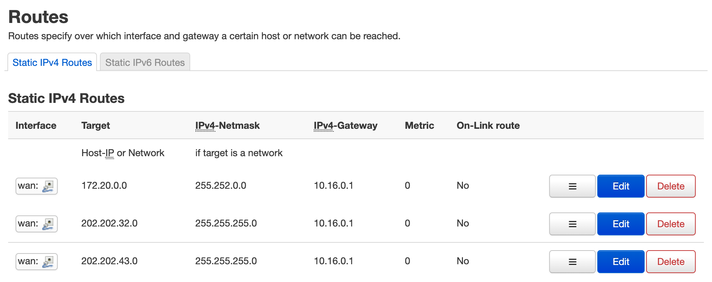

# RM2100-CQUPT-Edition

红米2100用户在你校上网的最优解决方案。


## 准备材料

- 刷入 `Breed` 的 `红米AC2100` 一份 
- 寝室内任意可利用起来的闲置服务器（如 `Raspberry Pi` ）
- `Bin` 目录下的固件


## 固件说明

此固件由官方仓库的 `OpenWrt-21.02` 分支编译而来，不含有任何插件，对你校网络有奇效。


## 使用方法

> 若你有正在运行中的 `OpenWrt` 固件，则跳转到 Step 2.

### Step 0.

将路由器 `WAN` 口与你寝室上方的光猫相连

### Step 1.

进入 `Breed`，刷入 `Tools` 目录下的 `MiddleRom`，开机，进入 `192.168.1.1`

### Step 2.

进入固件升级页面，刷入 `Bin` 下的固件

### Step 3.

刷好后，进入 `192.168.200.2` 登陆校园网，使用 `ssh` 连上路由器，执行以下操作。

1. 执行以下命令（可选）

```bash
opkg update
opkg install kmod-l2tp xl2tpd
```

2. 进入 `Network -> Interfaces`，删除 `WAN6`，在 `WAN` 中添加 `DNS: 172.22.161.254`

3. 进入 `Network -> DHCP and DNS`，取消勾选 `Rebind protection`

4. 进入 `Network -> Static Routes` ，按照下图进行编辑（目前我用到的，可能不全，欢迎提交 Issues）



### Step 4.（Optional）

打开 `192.168.200.2`，退出登陆

现在你可以编辑 `/etc/config/network`，添加以下内容进行 `L2TP` 拨号了。

```bash
config interface 'xxx'
        option ifname 'xxx'
        option proto 'l2tp'
        option server 'xxx'
        option username 'xxx'
        option password 'xxx'
```

### Step 5.（Optional）

例如你将路由 ip 改为了 192.168.2.1，你在 Raspberry Pi 上的科学网关为 192.168.2.2.

那么可以在 `Network -> Interfaces -> DHCP Server -> Advanced Settings` ，

中的 `DHCP-Options` 中添加：

- 3,192.168.2.2 （设置网关）
- 6,192.168.2.2 （设置 DNS）

### Step 6.

🛫️